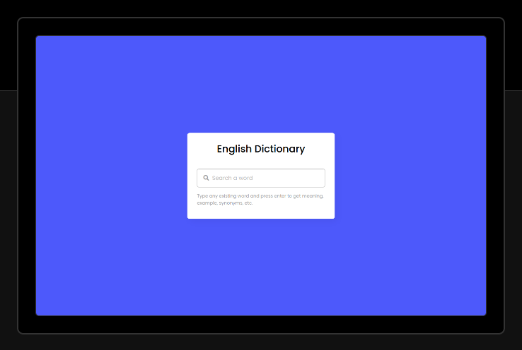

# English-Dictionary-in-JS

### Screenshot

### About
what is a dictionary and what it does do. In this project (Dictionary App in JavaScript), at first, on the webpage, there is only a search input and when you enter any existing word and press enter then there is shown a loading text of “Searching the meaning of…..”.

### Links

- Live Site URL: [View Live Demo](https://english-dictionary-pi.vercel.app/)
